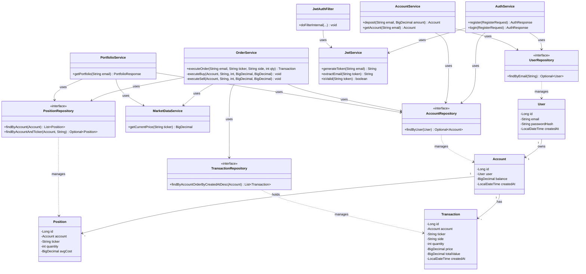
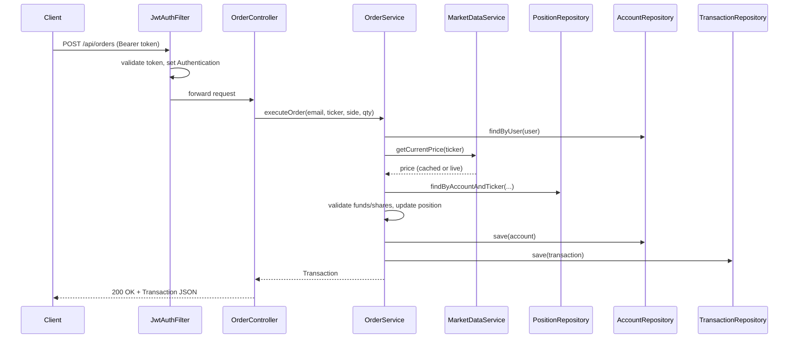

# Architecture & Design Patterns

This document breaks down the object-oriented design and architectural patterns used in the Fake Stock Market backend.

## Layered Architecture

The project follows a classic **layered (n-tier) architecture**, separating concerns into distinct responsibilities:

```
Controller  →  Service  →  Repository  →  Database
   (HTTP)      (business        (data
                 logic)         access)
```

Each layer only depends on the layer directly below it. Controllers never touch repositories directly, and services never know about HTTP — this keeps business logic testable and decoupled from the web framework.

| Layer | Responsibility | Classes |
|---|---|---|
| **Controller** | HTTP request/response handling, routing | `AuthController`, `AccountController`, `OrderController`, `PortfolioController`, `MarketController` |
| **Service** | Business logic, transactions, orchestration | `AuthService`, `AccountService`, `OrderService`, `PortfolioService`, `MarketDataService`, `JwtService` |
| **Repository** | Data access abstraction | `UserRepository`, `AccountRepository`, `PositionRepository`, `TransactionRepository` |
| **Model** | Domain entities, persistence mapping | `User`, `Account`, `Position`, `Transaction` |
| **DTO** | Data shape for API boundaries | `RegisterRequest`, `AuthResponse`, `OrderRequest`, `DepositRequest`, `PortfolioResponse`, `PositionView`, `QuoteResponse` |
| **Config** | Cross-cutting infrastructure | `SecurityConfig`, `JwtAuthFilter`, `CacheConfig` |

---

## Design Patterns in Use

### 1. Repository Pattern

Every entity has a corresponding repository interface (`AccountRepository`, `PositionRepository`, etc.) extending Spring Data's `JpaRepository`. This abstracts persistence logic behind an interface, so services never write raw SQL or know about the underlying database — they just call methods like `findByEmail(...)` or `findByAccountAndTicker(...)`.

```java
public interface PositionRepository extends JpaRepository<Position, Long> {
    List<Position> findByAccount(Account account);
    Optional<Position> findByAccountAndTicker(Account account, String ticker);
}
```

**Benefit:** the database technology could be swapped (e.g. PostgreSQL → MySQL) without touching service logic.

---

### 2. Dependency Injection (Constructor Injection)

Every service and controller declares its dependencies as `private final` fields and uses Lombok's `@RequiredArgsConstructor` to generate the constructor. Spring's IoC container resolves and injects these automatically.

```java
@Service
@RequiredArgsConstructor
public class OrderService {
    private final AccountRepository accountRepository;
    private final MarketDataService marketDataService;
    // ...
}
```

**Benefit:** classes don't instantiate their own dependencies, making them loosely coupled and easy to unit test (dependencies can be mocked).

---

### 3. Data Transfer Object (DTO) Pattern

Request/response shapes (`OrderRequest`, `PortfolioResponse`, `PositionView`) are kept entirely separate from JPA entities (`Order`, `Account`, `Position`). The API never exposes entity classes directly.

**Benefit:** decouples the public API contract from internal database schema — the schema can change without breaking the API, and sensitive fields (like `passwordHash`) are never accidentally serialized to a client.

---

### 4. Facade Pattern (via Service Layer)

`OrderService.executeOrder(...)` is a facade — a single method hides a complex sequence of operations (fetch user, fetch account, fetch live price, validate funds/shares, update position, update balance, record transaction) behind one simple call that the controller invokes.

```java
@Transactional(isolation = Isolation.SERIALIZABLE)
public Transaction executeOrder(String email, String ticker, String side, int quantity) {
    // orchestrates Account, Position, Transaction, and MarketDataService internally
}
```

**Benefit:** `OrderController` stays thin — it has no idea how many steps or classes are involved in placing an order.

---

### 5. Strategy-like Branching (Buy vs. Sell)

`executeOrder` delegates to `executeBuy(...)` or `executeSell(...)` based on the `side` parameter. While not a full Strategy pattern (no separate interface/implementations), it follows the same spirit — isolating two distinct algorithms for handling a trade behind a single entry point, keeping each one independently readable and testable.

---

### 6. Filter Chain Pattern (Spring Security)

`JwtAuthFilter` extends `OncePerRequestFilter` and is inserted into Spring Security's filter chain via `addFilterBefore(...)`. Each incoming request passes through this filter, which extracts and validates the JWT before the request reaches any controller.

```java
.addFilterBefore(jwtAuthFilter, UsernamePasswordAuthenticationFilter.class);
```

**Benefit:** authentication logic is centralized and runs uniformly across every endpoint, rather than being duplicated in each controller.

---

### 7. Caching (Proxy Pattern via Spring AOP)

`MarketDataService.getCurrentPrice(...)` is annotated with `@Cacheable`. Spring generates a proxy around the service at runtime — calls are intercepted, and if a cached value exists, the real method body never executes.

```java
@Cacheable(value = "stockPrices", key = "#ticker")
public BigDecimal getCurrentPrice(String ticker) { ... }
```

**Benefit:** transparently reduces external API calls (Alpha Vantage rate limits) without polluting business logic with caching code.

---

### 8. Single Responsibility Principle (applied throughout)

Each service has exactly one reason to change:
- `AuthService` — registration/login only
- `AccountService` — balance/deposit only
- `OrderService` — trade execution only
- `PortfolioService` — read-only portfolio aggregation
- `MarketDataService` — external market data only

This separation is why `PortfolioService` can reuse `MarketDataService` for live pricing without duplicating any HTTP-fetching logic.

---

## UML Class Diagram



---

## Request Flow Example: Placing an Order

